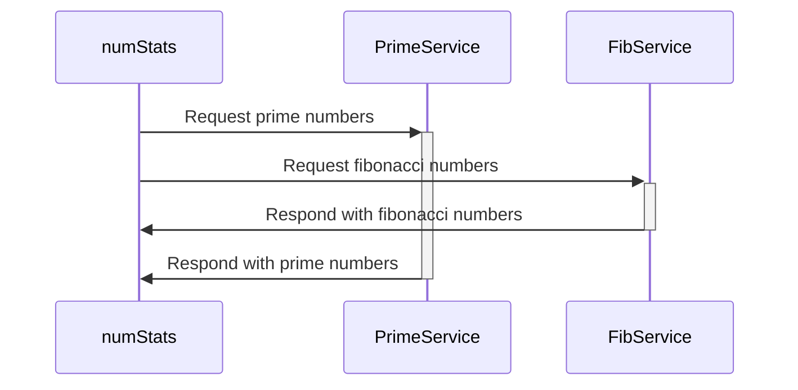

# Micro-demo

A simple set of microservices used to demonstrate various concepts related to building reliable microservices.

# Pipeline Architecture
The pipelines demonstrated in this repository are based on the AWS reference architecture found at https://aws-samples.github.io/aws-deployment-pipeline-reference-architecture/application-pipeline/

# Services
## Fibonacci Sequence Service

## Prime Service

## Number Stats Service

## Notes Service

## Architecture Diagram
